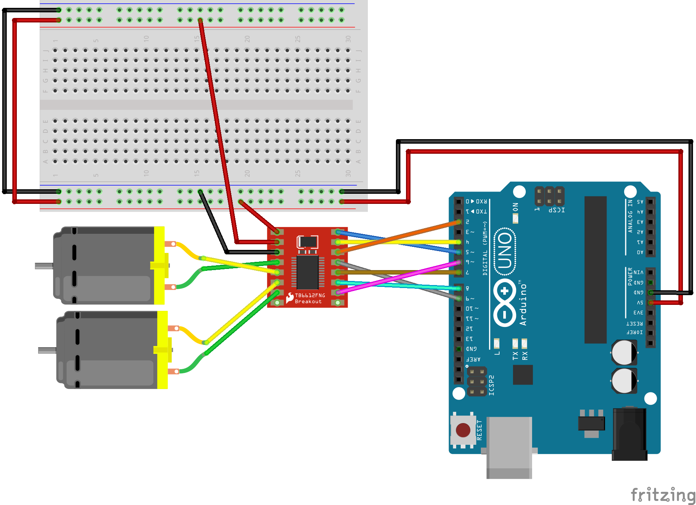

# Robot Car Workshop

In this workshop we will learn how to create very simple "robot cars," or Arduino-controlled vehicles using geared DC motors and a [Motor Driver module](https://www.sparkfun.com/products/14451) from Sparkfun.

You will need:
+ The [Motor Driver module](https://www.sparkfun.com/products/14451)
+ The [software library associated with the above driver](https://github.com/sparkfun/SparkFun_TB6612FNG_Arduino_Library/archive/master.zip)
+ A pair of "hobby" motors, which are DC motors geared to turn more slowly but with more torque. I am using [140 RPM motors from Sparkfun](https://www.sparkfun.com/products/13302)
+ A pair of wheels that attach to said motors. These can be digitally fabricated, or you can use [these wheels from Sparkfun](https://www.sparkfun.com/products/13259)

## Guide

We will use the [official hookup guide from Sparkfun](https://learn.sparkfun.com/tutorials/tb6612fng-hookup-guide) which is fairly complete, but makes use of a different Arduino than we have been working with. I will add some clarity on the matter below.

Modified wiring guide to suit Arduino Uno R3:



```c
/******************************************************************************
From https://github.com/sparkfun/SparkFun_TB6612FNG_Arduino_Library

Uses 2 motors to show examples of the functions in the library.  This causes
a robot to do a little 'jig'.  Each movement has an equal and opposite movement
so assuming your motors are balanced the bot should end up at the same place it
started.

******************************************************************************/

// This is the library for the TB6612 that contains the class Motor and all the
// functions
#include <SparkFun_TB6612.h>

// Pins for all inputs, keep in mind the PWM defines must be on PWM pins
// the default pins listed are the ones used on the Redbot (ROB-12097) with
// the exception of STBY which the Redbot controls with a physical switch
#define AIN1 2
#define BIN1 7
#define AIN2 4
#define BIN2 8
#define PWMA 5
#define PWMB 6
#define STBY 9

// these constants are used to allow you to make your motor configuration
// line up with function names like forward.  Value can be 1 or -1
const int offsetA = 1;
const int offsetB = 1;

// Initializing motors.  The library will allow you to initialize as many
// motors as you have memory for.  If you are using functions like forward
// that take 2 motors as arguements you can either write new functions or
// call the function more than once.
Motor motor1 = Motor(AIN1, AIN2, PWMA, offsetA, STBY);
Motor motor2 = Motor(BIN1, BIN2, PWMB, offsetB, STBY);

void setup()
{
 //Nothing here
}


void loop()
{
   //Use of the drive function which takes as arguements the speed
   //and optional duration.  A negative speed will cause it to go
   //backwards.  Speed can be from -255 to 255.  Also use of the
   //brake function which takes no arguements.
   motor1.drive(255,1000);
   motor1.drive(-255,1000);
   motor1.brake();
   delay(1000);

   //Use of the drive function which takes as arguements the speed
   //and optional duration.  A negative speed will cause it to go
   //backwards.  Speed can be from -255 to 255.  Also use of the
   //brake function which takes no arguements.
   motor2.drive(255,1000);
   motor2.drive(-255,1000);
   motor2.brake();
   delay(1000);

   //Use of the forward function, which takes as arguements two motors
   //and optionally a speed.  If a negative number is used for speed
   //it will go backwards
   forward(motor1, motor2, 150);
   delay(1000);

   //Use of the back function, which takes as arguments two motors
   //and optionally a speed.  Either a positive number or a negative
   //number for speed will cause it to go backwards
   back(motor1, motor2, -150);
   delay(1000);

   //Use of the brake function which takes as arguments two motors.
   //Note that functions do not stop motors on their own.
   brake(motor1, motor2);
   delay(1000);

   //Use of the left and right functions which take as arguements two
   //motors and a speed.  This function turns both motors to move in
   //the appropriate direction.  For turning a single motor use drive.
   left(motor1, motor2, 100);
   delay(1000);
   right(motor1, motor2, 100);
   delay(1000);

   //Use of brake again.
   brake(motor1, motor2);
   delay(1000);

}
```
