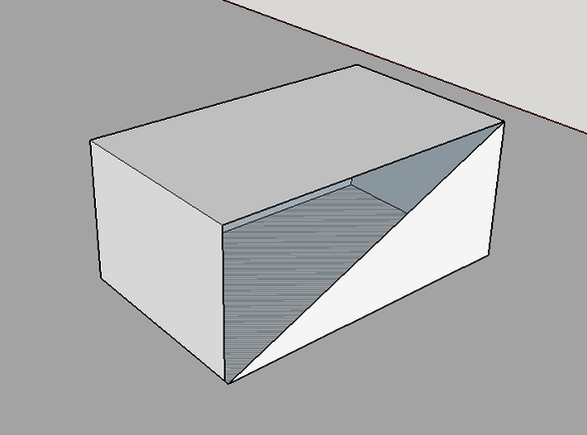
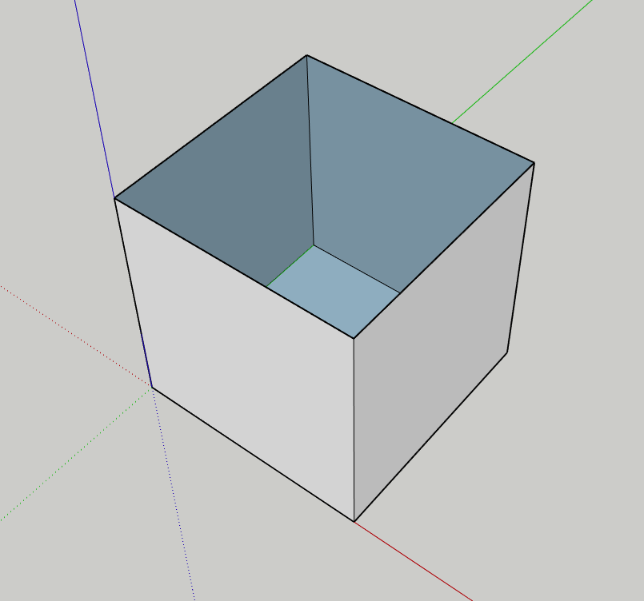
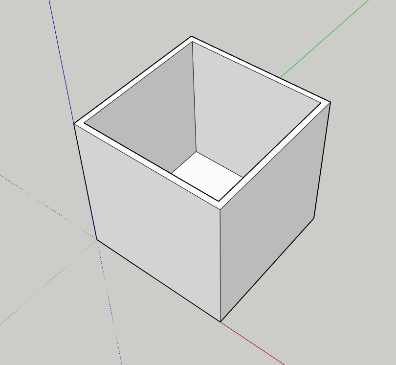
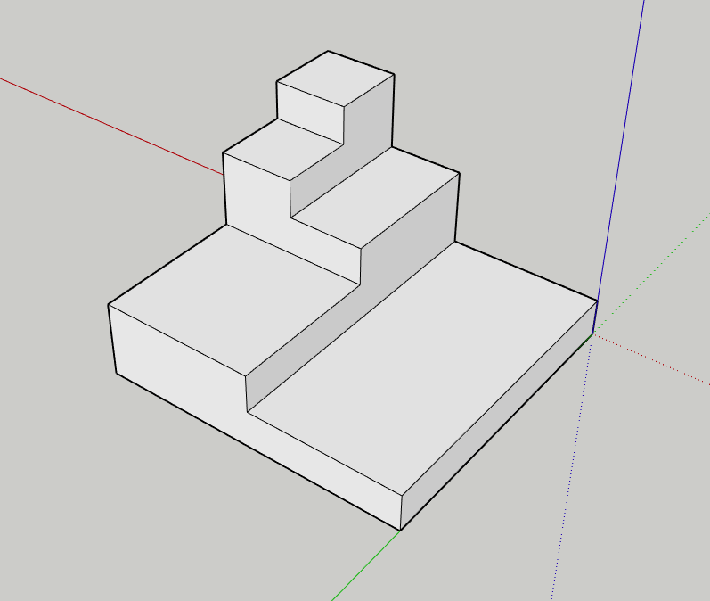

+ Do the Google Sketchup tutorials [Getting Started with Sketchup parts 1-4](https://www.sketchup.com/learn/videos/826)
	+ This will take you 45 minutes to follow along.
+ Create a 3d model in Sketchup with the intention of 3d printing it
	+ Some models won't work, and that's ok--we will address this later. For now, try to make sure they have no broken or invisible faces, which looks like this:

Notice how I can see through the object. The object must be solid in order for 3d printing to work properly. A box can't look like this:

It has to look like this:

As a general guide, you'll want to avoid having models like this:

The problem being that you want to have the base of your print be the platform for the rest. It's a hard thing to grasp without seeing a failed print, and modern printers can print "supports" that help address this.

Instead, you might consider making your print biggest at the base and then smaller as it goes up.

