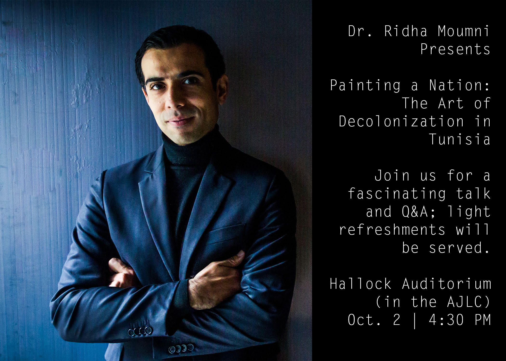

# week04

## Announcements

## Relevant work

## Tuesday

### Processing Lab (Learning Processing ch 7-9)

+ Topics covered ([use the reference to review](https://processing.org/reference/)):
	+ objects
	+ arraylists

+ [Quiz](quiz.md)

+ Review Dan Shiffman videos (especially  if you missed class)
	+ [Functions and Objects](https://www.youtube.com/watch?v=XCu7JSkgl04&vl=en)
	+ [Object Oriented Programming](https://www.youtube.com/watch?v=YcbcfkLzgvs&vl=en)
	+ [Arrays of Objects](https://www.youtube.com/watch?v=-sSRHRfK2EU)

## Thursday

+ Intro to TIMARA
+ Intro to Arduino
	+ Breadboard
	+ Microcontroller
	+ Wires
	+ Arduino IDE
	+ LED
	+ resistors
	+ Blink!
	+ More blinking!

## Homework

+ Read
	+ [Disobedient Electronics](http://www.disobedientelectronics.com/resources/Hertz-Disobedient-Electronics-Protest-201801081332c.pdf)
	+ Banzi - Getting Started w Arduino (via Library eBook) ch 1-3
