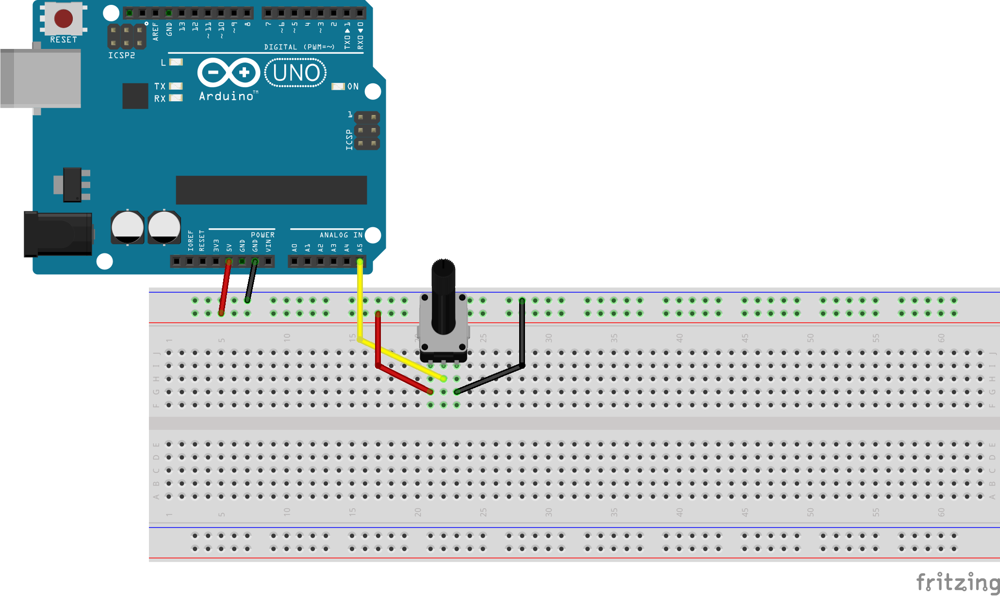
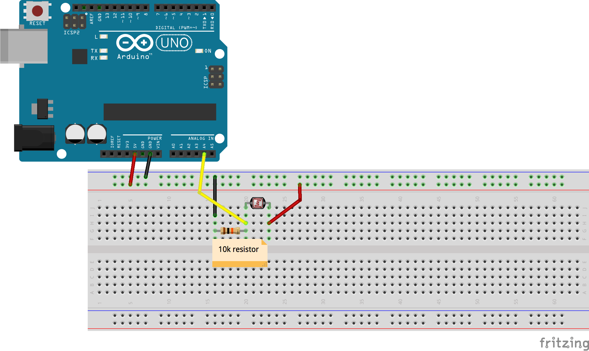

# week06

## Announcements

## Relevant work

+ [Tempescope](https://www.tempescope.com/)
	+ Weather outside is represented in a cube (clouds etc)
+ [Waves](https://vimeo.com/20500963)
	+ Installation responds to waves in the ocean
+ [Birdhouse](https://www.kickstarter.com/projects/1768080598/birdhouse-an-internet-of-things-work-of-art)
	+ Bird flies between these objects around the globe
+ [Brian House - Animas](https://brianhouse.net/works/animas/)

## Tuesday

### Arduino Lab

Wiring diagrams:



+ [Potentiometers](https://www.arduino.cc/en/tutorial/potentiometer)
+ [Photoresistors](https://www.arduino.cc/en/Tutorial/AnalogInput)

+ Topics covered
	+ Using variables to keep track of pins
	```
	int speakerPin = 7;
  pinMode(speakerPin, OUTPUT);
	```
	+ potentiometer - analogRead
		+ Note that analog pins don't require pinMode
	+ Serial.println() takes some time to run, so it can mess with the timing of your sketch
	+ map() function (works just like Processing)
	+ photoresistor - analogRead


## Thursday

+ Discuss
	+ [Interview with Natalie Jeremijenko](http://www.situatedtechnologies.net/files/ST3-SituatedAdvocacy_web.pdf)

## Homework
